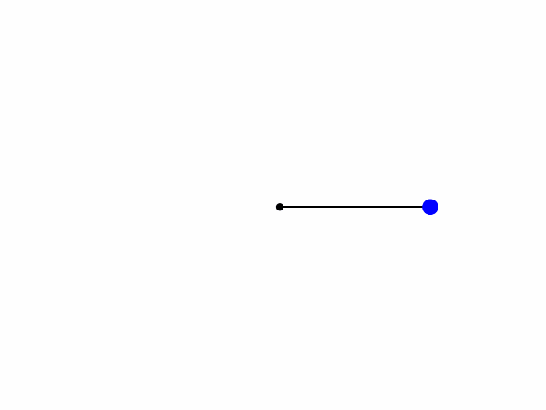

# reinforcement_learning_model

Train a reinforcement learning agent to hold a motorized arm upright in a physics simulation as seen below:

Relies on reinforcement learning fundamentals such as optimization, reward, decay, and exploration as well as physics theories of rotational and angular kinematics.

In this code, the agent teaches itself the best way to maneuver the weight and then maintain its position without any outside information or help. This requires extensive use of complex reinforcement learning principles to set up the model as well as lots of fine tuning to balance the variables for the agent's exploration, rewards, and learning rates in order to get the best results. It also called for the use of physics in order to calculate the agent's movement and convert its state from a physical position to one that the agent can understand.

Watch as the agent moves sporadically for several seconds before stabilizing and holding itself towards the top of the screen.
